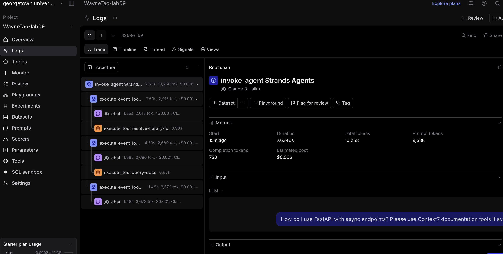

# analysis-mcp-observability.md

## Braintrust Observability Analysis

After running the agent and looking at the Braintrust traces, I found the trace view especially helpful for understanding what the agent is actually doing step by step. In this screenshot, I can see a clear hierarchy starting from `invoke_agent`, then multiple `execute_event_loop_cycle`, and inside those there are both `AI chat` steps and tool calls like `resolve-library-id` and `query-docs`. This makes it pretty obvious when the agent is thinking versus when it is calling external tools (in this case from the Context7 MCP server), which is something I wouldn’t be able to see just from the final answer alone.

  
*Shows a single trace with multiple spans, including MCP tool calls like `query-docs`.*

Another thing I noticed is how the execution is split into multiple cycles instead of just one step. It looks like the agent calls a tool, then continues reasoning, then calls another tool, and so on. That makes the process feel more like a loop rather than a single response. From the metrics on the right (like duration, token count, and cost), I can also tell that these tool-based queries take longer and involve more tokens compared to simple questions. Overall, this view gives a much clearer picture of how the agent combines LLM reasoning with tool usage behind the scenes.