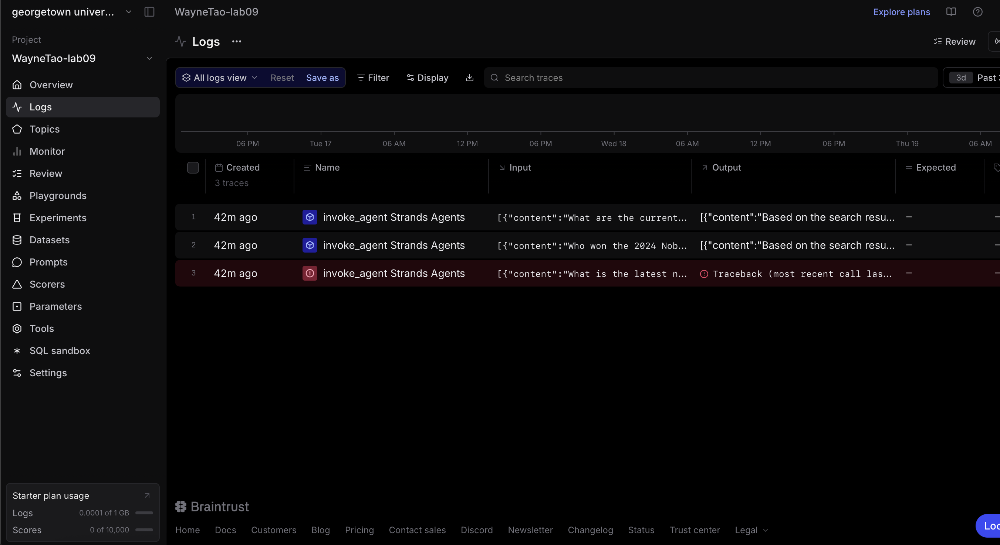
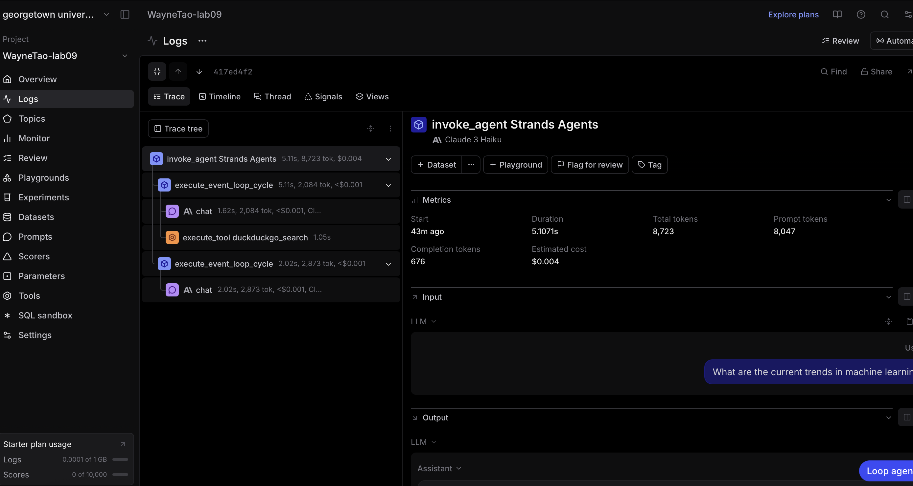
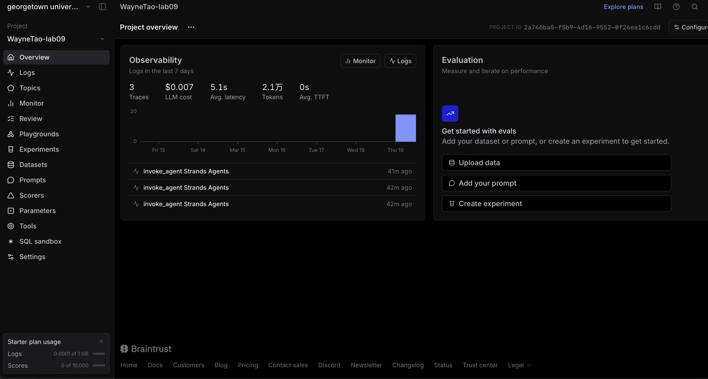

# analysis.md

## Braintrust Observability Analysis

After running the agent and checking the Braintrust dashboard, I found it pretty helpful to see how everything is broken down into traces. Each question shows up as its own trace, and inside it there are multiple steps like the main agent call, LLM response, and sometimes the DuckDuckGo search tool. For the questions about current events, I could clearly see the search tool being triggered, which makes it easier to understand why the agent behaves differently depending on the query.

  
*Each trace corresponds to one question I asked.*

When I clicked into a single trace, the structure became even clearer. I could see the order of operations and how the agent switches between generating text and calling tools. It’s nice that tool calls are separated out, because it helps show which part of the answer comes from external data versus the model itself.

  
*Shows the step-by-step execution of one query.*

The metrics part was also interesting. I noticed that queries using the search tool usually take longer and use more tokens compared to simple questions. So even though the answers might be better, there’s a clear tradeoff in latency and cost.

  
*Displays token usage, latency, and cost.*